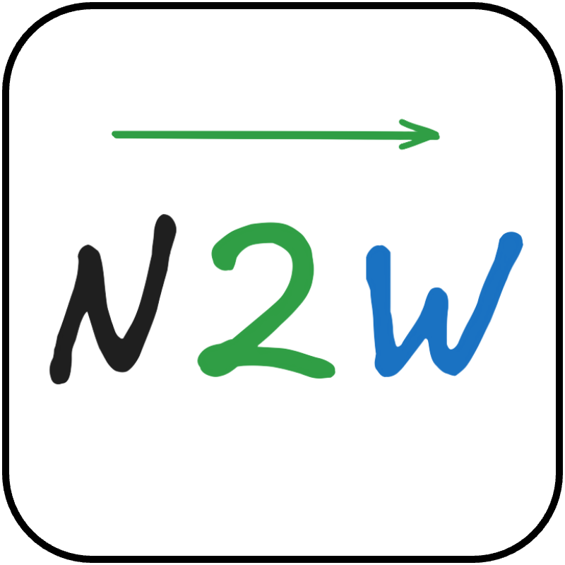

# Notion to WordPress

<p align="center">
  
</p>

An automated synchronization system that syncs Notion pages to WordPress blog as draft posts. Simply write your content in Notion and automatically publish it as a WordPress draft.

## 📋 Key Features

- **Automatic Synchronization**: Automatically converts Notion pages to WordPress draft posts
- **Image Handling**: Downloads images from Notion and uploads them to WordPress media library
- **Scheduling**: Cron-based periodic synchronization (default: every 5 minutes)
- **Manual Execution**: Support for manual synchronization via CLI
- **Error Handling**: Automatic retry on failure (default 3 times) and rollback
- **Notifications**: Telegram notifications for sync success/failure
- **Tracking**: SQLite-based synchronization history management

## 🔄 How It Works

1. Set the `status` property of your Notion page to `adding`
2. System automatically detects the page and syncs it to WordPress as a draft
3. On success, updates Notion `status` to `done`
4. Receive sync result notification via Telegram
5. Review the draft in WordPress admin panel and manually publish

## 📊 Status Property Values


- `writing`: Work in progress (ignored by sync)
- `adding`: Waiting for sync (will be sent to WordPress)
- `done`: Sync completed
- `error`: Sync failed

## 🚀 Quick Start

👇 Please refer to the quickstart guide: 
- [Quick Start Guide](./docs/quickstart.md)


## 🏗️ Tech Stack

- **Runtime**: Node.js 20.x, TypeScript 5.9.3
- **Notion API**: @notionhq/client 5.4.0
- **WordPress API**: axios 1.13.2
- **Content Conversion**: notion-to-md 3.1.9, marked 17.0.0
- **Scheduler**: node-cron 4.2.1
- **Database**: better-sqlite3 12.4.1
- **Notifications**: Telegraf 4.16.3
- **Testing**: Vitest 4.0.8
- **Deployment**: Docker

## 📁 Project Structure

```
src/
├── index.ts                 # Main entry point
├── cli/                     # CLI commands
├── config/                  # Environment configuration
├── db/                      # Database management
├── enums/                   # Type definitions
├── lib/                     # Utility functions
├── orchestrator/            # Sync orchestrator
└── services/                # External service integrations
    ├── notionService.ts     # Notion API
    ├── wpService.ts         # WordPress API
    └── telegramService.ts   # Telegram API
```

## 📖 Documentation

- [Specification](./docs/spec.md) - Complete feature and technical specifications
- [Quick Start Guide](./docs/quickstart.md) - Detailed setup instructions and examples
- [Sequence Diagrams](./docs/diagrams/) - Sync orchestration flow diagrams
- [Contracts](./docs/contracts/) - API interface definitions

## ⚠️ Limitations (MVP)

- No update sync: Only new pages are processed
- No auto-publish: All posts require manual admin approval in WordPress admin panel
- No deletion sync: WordPress posts are retained even when deleted in Notion
- No category/tag sync: WordPress defaults are used

## 🔒 Security

- Notion and Telegram APIs require HTTPS/TLS
- WordPress API recommends HTTPS (HTTP allowed for localhost/development environments)
- All credentials are managed via environment variables
- Enhanced WordPress account security using Application Passwords

## 📄 License

MIT License - See [LICENSE](./LICENSE) file for details.

## 🤝 Contributing

Issues and pull requests are always welcome!

## 📞 Contact

If you encounter any problems or have questions, please contact us through GitHub Issues.
