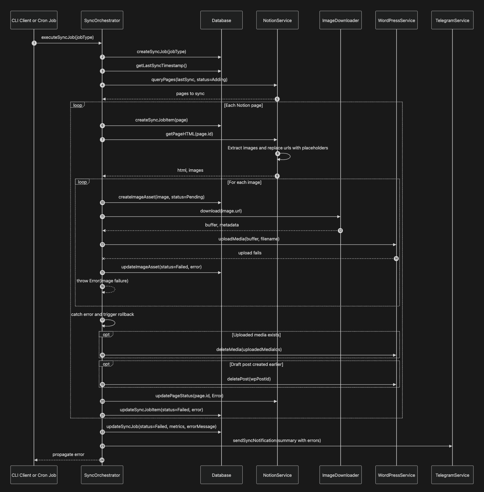
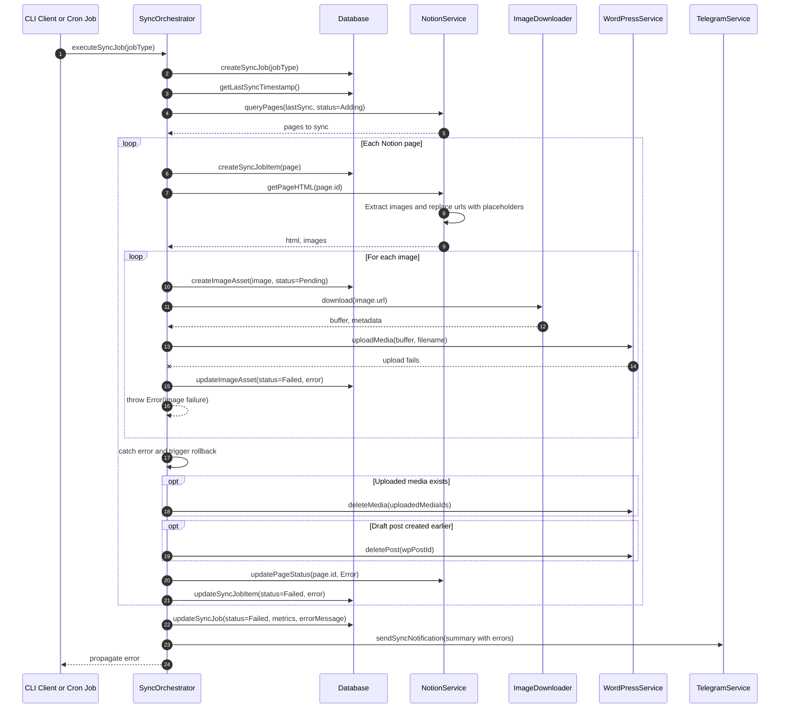

# Sync Orchestration Sequences

## Failed sync with rollback

```mermaid
sequenceDiagram
    autonumber
    participant ENTRY as CLI Client or Cron Job
    participant Orchestrator as SyncOrchestrator
    participant DB as Database
    participant Notion as NotionService
    participant Downloader as ImageDownloader
    participant WP as WordPressService
    participant Telegram as TelegramService

    ENTRY->>Orchestrator: executeSyncJob(jobType)
    Orchestrator->>DB: createSyncJob(jobType)
    Orchestrator->>DB: getLastSyncTimestamp()
    Orchestrator->>Notion: queryPages(lastSync, status=Adding)
    Notion-->>Orchestrator: pages to sync

    loop Each Notion page
        Orchestrator->>DB: createSyncJobItem(page)
        Orchestrator->>Notion: getPageHTML(page.id)
        Notion->>Notion: Extract images and replace urls with placeholders
        Notion-->>Orchestrator: html, images
        loop For each image
		        Orchestrator->>DB: createImageAsset(image, status=Pending)
            Orchestrator->>Downloader: download(image.url)
            Downloader-->>Orchestrator: buffer, metadata
            Orchestrator->>WP: uploadMedia(buffer, filename)
            WP--x Orchestrator: upload fails
            Orchestrator->>DB: updateImageAsset(status=Failed, error)
            Orchestrator-->>Orchestrator: throw Error(image failure)
        end
        Orchestrator->>Orchestrator: catch error and trigger rollback
        opt Uploaded media exists
            Orchestrator->>WP: deleteMedia(uploadedMediaIds)
        end
        opt Draft post created earlier
            Orchestrator->>WP: deletePost(wpPostId)
        end
        Orchestrator->>Notion: updatePageStatus(page.id, Error)
        Orchestrator->>DB: updateSyncJobItem(status=Failed, error)
    end

    Orchestrator->>DB: updateSyncJob(status=Failed, metrics, errorMessage)
    Orchestrator->>Telegram: sendSyncNotification(summary with errors)
    Orchestrator-->>ENTRY: propagate error
```

[Successful Sync Sequence](./sequence-sync-success.md)