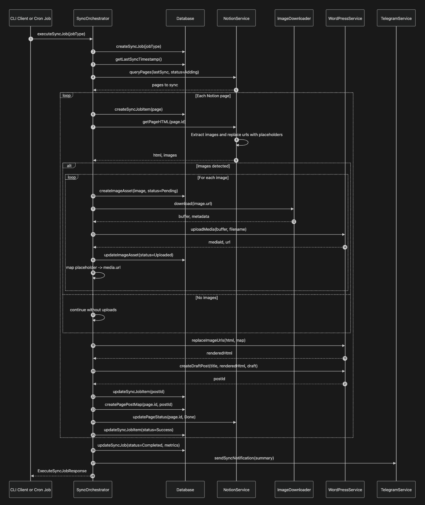
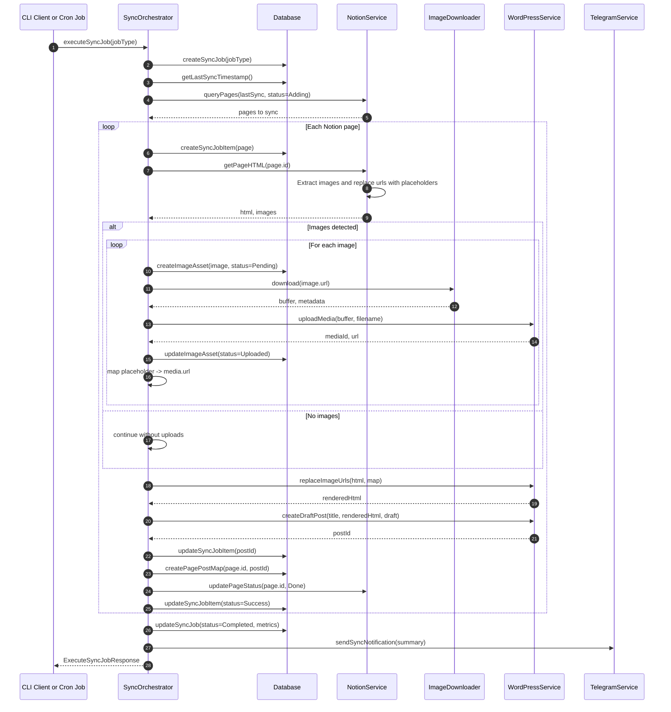

# Sync Orchestration Sequences

## Successful sync

```mermaid
sequenceDiagram
    autonumber
    participant ENTRY as CLI Client or Cron Job
    participant Orchestrator as SyncOrchestrator
    participant DB as Database
    participant Notion as NotionService
    participant Downloader as ImageDownloader
    participant WP as WordPressService
    participant Telegram as TelegramService

    ENTRY->>Orchestrator: executeSyncJob(jobType)
    Orchestrator->>DB: createSyncJob(jobType)
    Orchestrator->>DB: getLastSyncTimestamp()
    Orchestrator->>Notion: queryPages(lastSync, status=Adding)
    Notion-->>Orchestrator: pages to sync

    loop Each Notion page
        Orchestrator->>DB: createSyncJobItem(page)
        Orchestrator->>Notion: getPageHTML(page.id)
        Notion->>Notion: Extract images and replace urls with placeholders
        Notion-->>Orchestrator: html, images
        alt Images detected
            loop For each image
		            Orchestrator->>DB: createImageAsset(image, status=Pending)
                Orchestrator->>Downloader: download(image.url)
                Downloader-->>Orchestrator: buffer, metadata
                Orchestrator->>WP: uploadMedia(buffer, filename)
                WP-->>Orchestrator: mediaId, url
                Orchestrator->>DB: updateImageAsset(status=Uploaded)
                Orchestrator->>Orchestrator: map placeholder -> media.url
            end
        else No images
            Orchestrator->>Orchestrator: continue without uploads
        end
        Orchestrator->>WP: replaceImageUrls(html, map)
        WP-->>Orchestrator: renderedHtml
        Orchestrator->>WP: createDraftPost(title, renderedHtml, draft)
        WP-->>Orchestrator: postId
        Orchestrator->>DB: updateSyncJobItem(postId)
        Orchestrator->>DB: createPagePostMap(page.id, postId)
        Orchestrator->>Notion: updatePageStatus(page.id, Done)
        Orchestrator->>DB: updateSyncJobItem(status=Success)
    end

    Orchestrator->>DB: updateSyncJob(status=Completed, metrics)
    Orchestrator->>Telegram: sendSyncNotification(summary)
    Orchestrator-->>ENTRY: ExecuteSyncJobResponse
```

[Failed Sync Sequence](./sequence-sync-failure.md)
