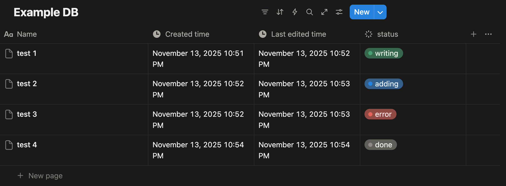
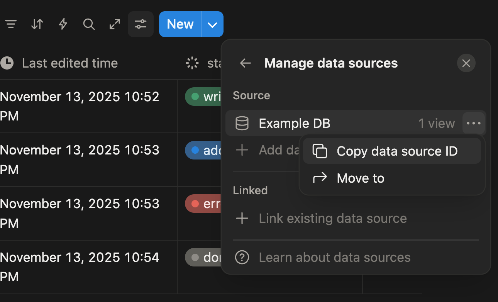

# Quickstart Guide: Notion to WordPress Sync for Developers

**Date**: 2025-11-23  
**Version**: 1.1

## Overview

This guide provides a quick reference for setting up and running the Notion-WordPress sync system. It covers environment setup, configuration, deployment, and basic operations.
<br><br>

## Table of Contents
1. [Prerequisites](#prerequisites)
2. [Setup Steps](#setup-steps)
3. [Obtaining Credentials](#obtaining-credentials)
4. [Database Setup](#database-setup)
5. [Running the Sync Service](#running-the-sync-service)
6. [Usage](#usage)
7. [Troubleshooting](#troubleshooting)
8. [Monitoring](#monitoring)
9. [Maintenance](#maintenance)
10. [FAQ](#faq)
11. [Security Best Practices](#security-best-practices)
12. [Support](#support)
---
<br><br>
## Prerequisites

- **Node.js**: Version 20.x LTS or higher
- **Docker**: Version 20.x or higher (for containerized deployment)
- **Notion**: 
  - Integration token with access to target datasource
  - datasource must be shared with the integration
  - Required capabilities: Read content, Update content
- **WordPress**: 
  - Site with REST API enabled
  - User account with Author or Editor role
  - Application Password feature enabled
- **Telegram**: 
  - Bot token from @BotFather
  - Chat ID for notifications
  - Bot must be started by user or added to channel

---
<br><br>
## Setup Steps

### 1. Clone Repository

```bash
git clone https://github.com/ramen4598/Notion2Wordpress.git
cd Notion2Wordpress
```

### 2. Install Dependencies

```bash
npm install
```

Installed versions:
- `@notionhq/client`: 5.4.0
- `axios`: 1.13.2
- `better-sqlite3`: 12.4.1
- `dotenv`: 17.2.3
- `form-data`: 4.0.4
- `marked`: 17.0.0
- `node-cron`: 4.2.1
- `notion-to-md`: 3.1.9
- `telegraf`: 4.16.3
- `typescript`: 5.9.3
- `vitest`: 4.0.8
- `eslint`: 9.38.1
- `prettier`: 3.6.2
<br><br>
### 3. Configure Environment Variables

Create a `.env` file in the project root:

```bash
cp .env.example .env
```

Edit `.env` with your credentials:

| Variable | Required | Default | Description |
|----------|----------|---------|-------------|
| `NOTION_API_TOKEN` | ✅ | - | Notion integration token (format: `ntn_...`) |
| `NOTION_DATASOURCE_ID` | ✅ | - | Target Notion datasource UUID (32 chars, no hyphens) |
| `NOTION_PAGE_PROPERTY_NAME` | ❌ | `status` | Property name in Notion to track page status |
| `WP_API_URL` | ✅ | - | WordPress REST API base URL (HTTPS for production) |
| `WP_USERNAME` | ✅ | - | WordPress username (must have Author/Editor role) |
| `WP_APP_PASSWORD` | ✅ | - | WordPress Application Password |
| `TELEGRAM_ENABLED` | ❌ | `true` | Enable/disable Telegram notifications |
| `TELEGRAM_BOT_TOKEN` | ✅* | - | Telegram bot token from @BotFather |
| `TELEGRAM_CHAT_ID` | ✅* | - | Telegram chat/channel ID for notifications |
| `SYNC_SCHEDULE` | ❌ | `*/5 * * * *` | Cron schedule expression (every 5 min) |
| `LOG_LEVEL` | ❌ | `warn` | Logging level (debug/info/warn/error) |
| `NODE_ENV` | ❌ | `development` | Environment (development/production) |
| `MAX_CONCURRENT_IMAGE_DOWNLOADS` | ❌ | `3` | Maximum concurrent image downloads |
| `IMAGE_DOWNLOAD_TIMEOUT_MS` | ❌ | `30000` | Image download timeout in milliseconds |
| `MAX_RETRY_ATTEMPTS` | ❌ | `3` | Maximum retry attempts for failed operations |
| `RETRY_INITIAL_DELAY_MS` | ❌ | `1000` | Initial retry delay in milliseconds |
| `RETRY_MAX_DELAY_MS` | ❌ | `30000` | Maximum retry delay in milliseconds |
| `RETRY_BACKOFF_MULTIPLIER` | ❌ | `2` | Backoff multiplier for exponential retry |
| `N2W_VERSION` | ❌ | `latest` | Docker image version tag |

**Note**: Variables marked with ✅* are required only when `TELEGRAM_ENABLED=true`.


- Cron Schedule Examples
```bash
# Every 5 minutes
SYNC_SCHEDULE="*/5 * * * *"

# Every hour at :00
SYNC_SCHEDULE="0 * * * *"

# Every day at 2:00 AM
SYNC_SCHEDULE="0 2 * * *"

# Every Monday at 9:00 AM
SYNC_SCHEDULE="0 9 * * 1"
```

---
<br><br>
## Obtaining Credentials

### Notion Integration Token

1. Visit https://www.notion.so/my-integrations
2. Click "New integration"
3. Name: "Notion2WordPress Sync"
4. Select workspace and capabilities:
   - ✅ Read content
   - ✅ Update content
5. Copy the "Internal Integration Token"
6. Share your datasource with the integration:
   - Open datasource in Notion
   - Click "..." → "Add connections"
   - Select your integration

### Notion Datasource ID



1. Create a database in Notion
2. Add a status property with the name matching `NOTION_PAGE_PROPERTY_NAME` in `.env` (default: `status`)
3. Configure the status property with these options:
   - `writing`: Ignored by sync (pages in draft state)
   - `adding`: Triggers sync to WordPress draft
   - `done`: Successfully synced to WordPress
   - `error`: Sync operation failed
4. Open the database as a full page
5. Copy the data source ID from the URL:
   ```
   https://www.notion.so/{workspace}/{DATA_SOURCE_ID}?v=...
   ```
6. The data source ID is a 32-character string (no hyphens)
7. Paste this ID into `NOTION_DATASOURCE_ID` in your `.env` file

**Note**: The database must be shared with your Notion integration for the sync to work.
<br><br>
### WordPress Application Password

1. Log in to WordPress admin panel
2. Navigate to: Users → Profile
3. Scroll to "Application Passwords"
4. Name: "Notion Sync"
5. Click "Add New Application Password"
6. Copy the generated password (format: `xxxx xxxx xxxx xxxx`)

**Note**: Your WordPress user must have "Author" or "Editor" role.
<br><br>
### Telegram Bot Token

1. Open Telegram and search for `@BotFather`
2. Send `/newbot` command
3. Follow prompts to name your bot
4. Copy the bot token (format: `1234567890:ABCdef...`)
<br><br>
### Telegram Chat ID

**For personal chat**:
1. Send a message to your bot
2. Visit: `https://api.telegram.org/bot{YOUR_BOT_TOKEN}/getUpdates`
3. Find `"chat":{"id":...}` in the response

**For channel**:
1. Add your bot as channel admin
2. Use channel username: `@your_channel` or numeric ID

---
<br><br>
## Database Setup

The SQLite database is auto-created on first run. To manually initialize:

```bash
npm run db:init
```

This creates `./data/sync.db` with the schema defined in `config/schema.sql`.

---
<br><br>
## Running the Sync Service

### Local Development

```bash
# Run once (manual sync)
npm run sync:manual

# Start daemon (scheduled sync) 
npm run build # requires build first
npm run start

# Development mode (with auto-restart, no build needed)
npm run dev
```

### Docker Deployment

Build and run the container:

```bash
# Build image
docker build -t notion2wp .

# Run container
docker run -d \
  --name notion2wp \
  --env-file .env \
  -v $(pwd)/data:/app/data \
  --restart unless-stopped \
  notion2wp
```

Or you can use prebuilt image from GitHub:

```bash
docker run -d \
  --name notion2wp \
  --env-file .env \
  -v $(pwd)/data:/app/data \
  --restart unless-stopped \
  ghcr.io/ramen4598/notion2wordpress:latest
```

**Using Docker Compose** (recommended):

```bash
docker-compose up -d
```

View logs:

```bash
docker-compose logs -f
```

---
<br><br>
## Usage

### Notion Workflow

1. **Create page** in monitored Notion datasource
2. **Set status** to `"writing"` while drafting (default, sync ignores)
3. **Change status** to `"adding"` when ready to sync
4. **Wait for sync**: Next scheduled run
5. **Check Telegram**: Receive success notification
6. **Review in WordPress**: Log in and find draft post
7. **Publish**: Manually publish after review

### Checking Sync Status

**View recent sync jobs**:
```bash
npm run logs:sync
```

**Query database**:
```bash
sqlite3 ./data/sync.db "SELECT * FROM sync_jobs ORDER BY started_at DESC LIMIT 5;"
```

**View failed syncs**:
```bash
sqlite3 ./data/sync.db "SELECT * FROM sync_job_items WHERE status='failed';"
```

### Manual Trigger

To run sync immediately (outside scheduled cron):

```bash
npm run sync:manual
```

Or via Docker:
```bash
docker exec notion2wp npm run sync:manual
```

---
<br><br>
## Troubleshooting

### Common Issues

#### 1. "Notion authentication failed"

**Cause**: Invalid `NOTION_API_TOKEN` or datasource not shared with integration

**Solution**:
- Verify token format: `ntn_...` (50 characters)
- Check datasource connection in Notion (Add connections → Select integration)

---

#### 2. "WordPress 401 Unauthorized"

**Cause**: Invalid credentials or Application Passwords not enabled

**Solution**:
- Verify `WP_USERNAME` matches WordPress account
- Re-generate Application Password
- Ensure WordPress REST API is enabled (check `{WP_URL}/wp-json`)

---

#### 3. "Image upload failed: 413 Payload Too Large"

**Cause**: Image exceeds WordPress upload limit

**Solution**:
- Increase `upload_max_filesize` in WordPress `php.ini`
- Or resize images in Notion before syncing

---

#### 4. "Telegram notification failed"

**Cause**: Invalid bot token or chat ID

**Solution**:
- Verify bot token via: `https://api.telegram.org/bot{TOKEN}/getMe`
- Verify chat ID via: `https://api.telegram.org/bot{TOKEN}/getUpdates`
- Ensure bot is added to channel (if using channel)

---

#### 5. "Database locked" error

**Cause**: Multiple sync processes running simultaneously

**Solution**:
- Stop all running instances
- Restart with single process: `docker-compose restart`

---

### Logs

```bash
# Docker
docker-compose logs -f
```

---

### E2E Test (manual workflow)

1. Create test Notion page
2. Add sample content + image
3. Set status to `"adding"`
4. Wait for sync notification
5. Verify WordPress draft exists
6. Clean up: Delete WP post, set Notion status to `"writing"`

---
<br><br>
## Monitoring

### Health Checks

Check if service is running:
```bash
docker ps | grep notion2wp
```

Check last sync time:
```bash
sqlite3 ./data/sync.db "SELECT started_at, status FROM sync_jobs ORDER BY started_at DESC LIMIT 1;"
```
timezone: UTC

---
<br><br>
## Maintenance

### Transport Security

- Notion API and Telegram Bot API: HTTPS/TLS only
- WordPress API: HTTPS/TLS (production) and HTTP (allowed for local/self-hosted dev)

### Backup Database

```bash
# Stop service
docker-compose stop

# Backup database
cp ./data/sync.db ./data/sync.db.backup.$(date +%Y%m%d)

# Restart service
docker-compose start
```

### Clean Up Old Jobs

Delete sync job records older than 30 days:
```bash
sqlite3 ./data/sync.db "DELETE FROM sync_jobs WHERE started_at < datetime('now', '-30 days');"
```

---
<br><br>
## FAQ

**Q: Can I sync multiple Notion datasources?**  
A: Not in MVP. Future version will support multiple datasources via config file.

**Q: Will it sync changes to already-published posts?**  
A: No. MVP only creates new drafts.

**Q: What happens if I manually delete a WordPress post?**  
A: Mapping remains in database. Future sync won't recreate (idempotency not in MVP).

**Q: Can I customize the HTML output format?**  
A: No. This project depends on `notion-to-md` for conversion.

**Q: How do I pause syncing temporarily?**  
A: Stop the Docker container: `docker-compose stop`. Restart when ready.

---
<br><br>
## Security Best Practices

- Never commit `.env` file to version control
- Use HTTPS for WordPress API in production
- Rotate Application Passwords periodically
- Keep Docker images updated
- Backup database before major updates

---
<br><br>
## Support

- **Issues**: Report bugs via GitHub Issues
- **Logs**: Check `docker-compose logs` for error details
