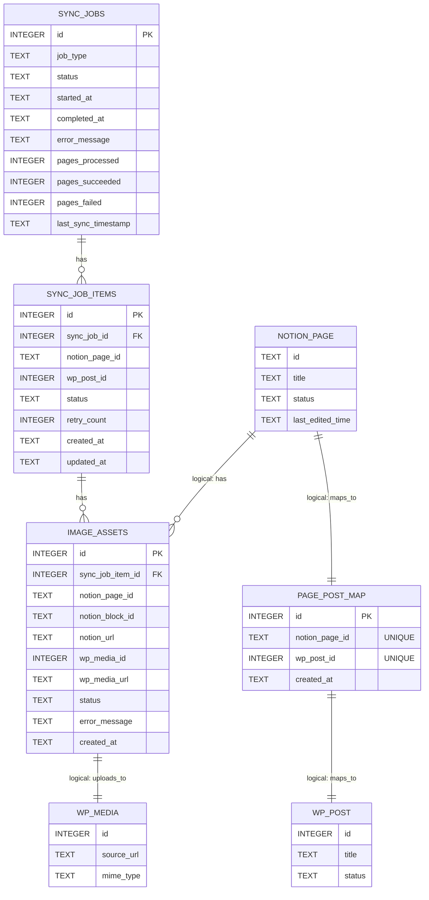

# ERD (Mermaid)

```mermaid
erDiagram
    SYNC_JOBS ||--o{ SYNC_JOB_ITEMS : has
    SYNC_JOB_ITEMS ||--o{ IMAGE_ASSETS : has

    SYNC_JOBS {
      INTEGER id PK
      TEXT job_type
      TEXT status
      TEXT started_at
      TEXT completed_at
      TEXT error_message
      INTEGER pages_processed
      INTEGER pages_succeeded
      INTEGER pages_failed
      TEXT last_sync_timestamp
    }

    SYNC_JOB_ITEMS {
      INTEGER id PK
      INTEGER sync_job_id FK
      TEXT notion_page_id
      INTEGER wp_post_id
      TEXT status
      INTEGER retry_count
      TEXT created_at
      TEXT updated_at
    }

    IMAGE_ASSETS {
      INTEGER id PK
      INTEGER sync_job_item_id FK
      TEXT notion_page_id
      TEXT notion_block_id
      TEXT notion_url
      INTEGER wp_media_id
      TEXT wp_media_url
      TEXT status
      TEXT error_message
      TEXT created_at
    }

    PAGE_POST_MAP {
      INTEGER id PK
      TEXT notion_page_id "UNIQUE"
      INTEGER wp_post_id "UNIQUE"
      TEXT created_at
    }

    %% External (logical)
    NOTION_PAGE {
      TEXT id
      TEXT title
      TEXT status
      TEXT last_edited_time
    }

    WP_POST {
      INTEGER id
      TEXT title
      TEXT status
    }

    WP_MEDIA {
      INTEGER id
      TEXT source_url
      TEXT mime_type
    }

    %% Logical Relationships (no FK)
    NOTION_PAGE ||--o{ IMAGE_ASSETS : "logical: has"
    NOTION_PAGE ||--|| PAGE_POST_MAP : "logical: maps_to"
    PAGE_POST_MAP ||--|| WP_POST : "logical: maps_to"
    IMAGE_ASSETS ||--|| WP_MEDIA : "logical: uploads_to"
```
