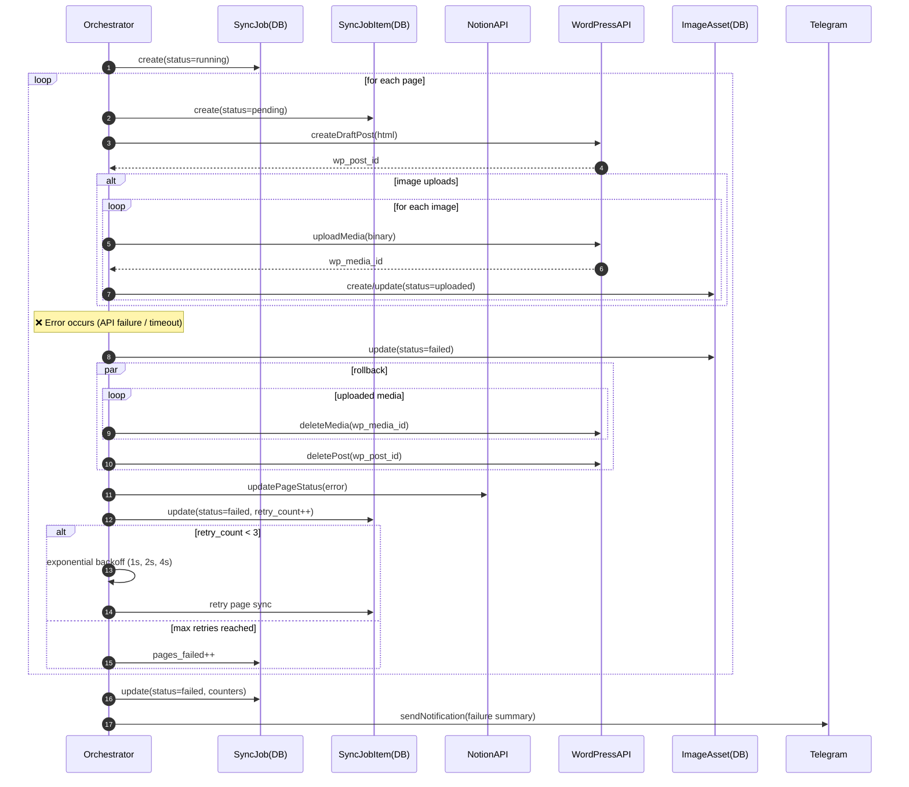

# Sequence Diagram (Failure & Rollback)

```mermaid
sequenceDiagram
    autonumber
    participant Orc as Orchestrator
    participant Job as SyncJob(DB)
    participant Item as SyncJobItem(DB)
    participant Notion as NotionAPI
    participant WP as WordPressAPI
    participant Asset as ImageAsset(DB)
    participant TG as Telegram

    Orc->>Job: create(status=running)

    loop for each page
        Orc->>Item: create(status=pending)
        Orc->>WP: createDraftPost(html)
        WP-->>Orc: wp_post_id

        alt image uploads
            loop for each image
                Orc->>WP: uploadMedia(binary)
                WP-->>Orc: wp_media_id
                Orc->>Asset: create/update(status=uploaded)
            end
        end

        note over Orc: ❌ Error occurs (API failure / timeout)
        Orc->>Asset: update(status=failed)

        par rollback
            loop uploaded media
                Orc->>WP: deleteMedia(wp_media_id)
            end
            Orc->>WP: deletePost(wp_post_id)
        end

        Orc->>Notion: updatePageStatus(error)
        Orc->>Item: update(status=failed, retry_count++)

        alt retry_count < 3
            Orc->>Orc: exponential backoff (1s, 2s, 4s)
            Orc->>Item: retry page sync
        else max retries reached
            Orc->>Job: pages_failed++
        end
    end

    Orc->>Job: update(status=failed, counters)
    Orc->>TG: sendNotification(failure summary)
```
