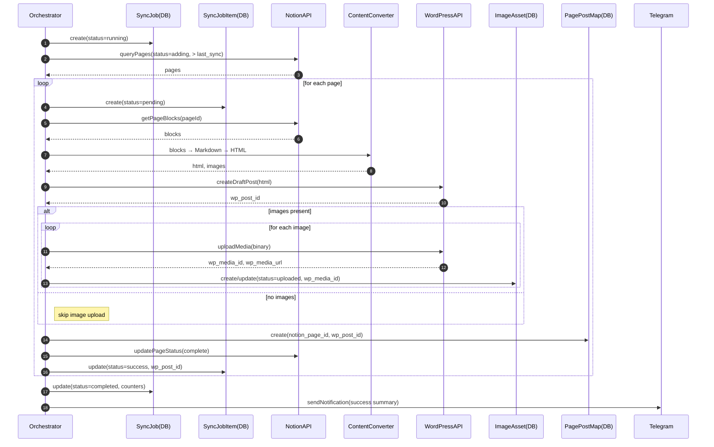

# Sequence Diagram (Success)

```mermaid
sequenceDiagram
    autonumber
    participant Orc as Orchestrator
    participant Job as SyncJob(DB)
    participant Item as SyncJobItem(DB)
    participant Notion as NotionAPI
    participant Conv as ContentConverter
    participant WP as WordPressAPI
    participant Asset as ImageAsset(DB)
    participant Map as PagePostMap(DB)
    participant TG as Telegram

    Orc->>Job: create(status=running)
    Orc->>Notion: queryPages(status=adding, > last_sync)
    Notion-->>Orc: pages

    loop for each page
        Orc->>Item: create(status=pending)
        Orc->>Notion: getPageBlocks(pageId)
        Notion-->>Orc: blocks
        Orc->>Conv: blocks → Markdown → HTML
        Conv-->>Orc: html, images
        Orc->>WP: createDraftPost(html)
        WP-->>Orc: wp_post_id

        alt images present
            loop for each image
                Orc->>WP: uploadMedia(binary)
                WP-->>Orc: wp_media_id, wp_media_url
                Orc->>Asset: create/update(status=uploaded, wp_media_id)
            end
        else no images
            note right of Orc: skip image upload
        end

        Orc->>Map: create(notion_page_id, wp_post_id)
        Orc->>Notion: updatePageStatus(complete)
        Orc->>Item: update(status=success, wp_post_id)
    end

    Orc->>Job: update(status=completed, counters)
    Orc->>TG: sendNotification(success summary)
```
